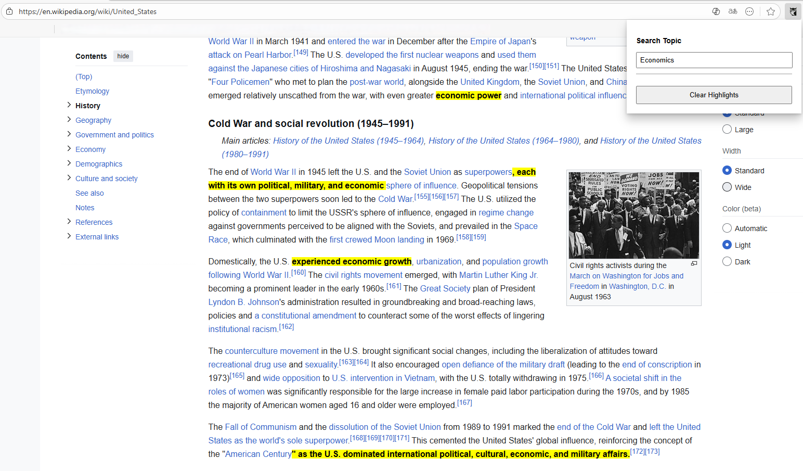

# WiseOwl
### Semantic Highlighter Chrome Extension
<p align="center">

</p>
A "smart" text highlighter for Chrome. This extension allows you to search a database of 100+ topics and highlights all semantically related text on the page you're reading.

<p align="center">

</p>
---

## 🚀 Features

* **Fast Search:** Instantly find topics using [Fuse.js](https://fusejs.io/) for a "fuzzy" search-as-you-type experience.
* **Intelligent Database:** Includes 100+ pre-calculated topics, each with an expanded list of semantically related keywords.
* **100% Private & Fast:** All processing happens locally in your browser. Your browsing data never leaves your machine.
* **Easy Cleanup:** A single click removes all highlights from the page.

---

## 🛠️ How It Works (Architecture)

This project uses a **hybrid approach** to balance intelligence and performance, avoiding the need to load heavy AI models in the browser.

1.  **At Build Time (Offline):**
    * A Python script (`generate_topics.py`) uses `nltk (WordNet)` to generate a corpus of thousands of keywords.
    * It then uses `sentence-transformers` to compare the 100+ "base topics" against the corpus.
    * It generates the extension's "brain": a massive `topics.json` file that maps each topic to its list of semantically similar keywords.

2.  **At Runtime (In the Extension):**
    * **Popup (`popup.js`):** Loads only the topic *names* from `topics.json` and uses `Fuse.js` to power the search bar.
    * **Content Script (`content.js`):** When the user selects a topic, the script loads the full `topics.json` (once, with caching), finds the keyword list for that topic, and traverses the page's DOM to highlight any matches.

---

## 💻 Installation (for Development)

To clone and run this project locally:

1.  **Clone the repository:**
    ```bash
    git clone [https://github.com/your-username/chrome-nlp-highlighter.git](https://github.com/your-username/chrome-nlp-highlighter.git)
    cd chrome-nlp-highlighter
    ```

2.  **Install dependencies:**
    ```bash
    npm install
    ```

3.  **Build the extension:**
    * For a production build (minified):
        ```bash
        npm run build
        ```
    * For development mode (auto-rebuilds on file changes):
        ```bash
        npm run dev
        ```

4.  **Load the extension in Chrome:**
    * Open Chrome and go to `chrome://extensions`.
    * Enable **"Developer mode"** in the top-right corner.
    * Click **"Load unpacked"**.
    * Select the `dist` folder that was generated in your project.

---

## 📜 License

This project is under the MIT License. See the `LICENSE` file for more details.
